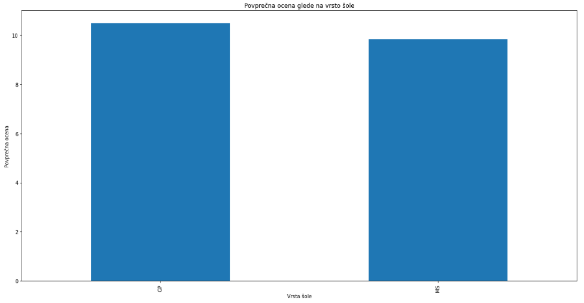
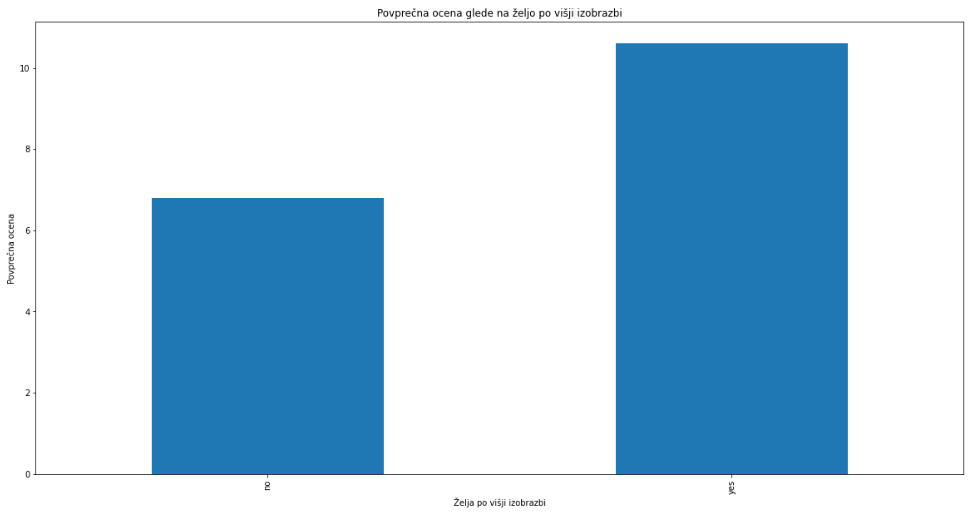
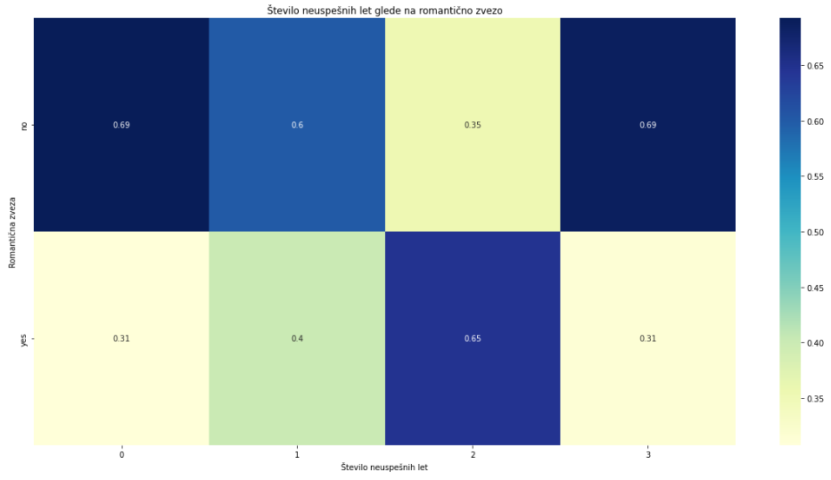

# PR22sp

# Analiza uspešnosti študentov

## Avtor

-   Samo Pungaršek Pritržnik

## Izbor podatkovne množice

[Podatke](https://www.kaggle.com/datasets/devansodariya/student-performance-data) sem pridobil iz spletne strani [Kaggle](https://www.kaggle.com). Podatki so zbrani iz predmeta matematika.

Podatki so strukturirani tako, da vsaka vrstica predstavlja enega študenta, stolpci pa informacije o njem. Vsebujejo podatke o študentovih ocenah, spolu, starosti, šolskih rezultatih, socialnem statusu in številu ur, ki jih preživijo na šoli.

## Oblika podatkov

Podatki so shranjeni v datoteki `student-mat.csv` in so strukturirani v obliki CSV (comma-separated values). Vsebujejo 395 vrstic in 33 stolpcev. Vrstice predstavljajo posameznega študenta, stolpci pa njegove lastnosti. Vsebujejo podatke o študentovih ocenah, spolu, starosti, šolskih rezultatih, socialnem statusu in številu ur, ki jih preživijo na šoli.

## Cilji analize

Pri projektu skušamo ugotoviti razne povezave med lastnosmi študentov in njihovimi uspehi. 

Cilji so naslednji:
- Povezava med številom preteklih neuspehov in končno oceno predmeta.
- Povezava med tem ali je študent v romantični zvezi in številom preteklih neuspehov.
- Povezava med velikostjo družine in ali si študent želi višjo izobrazbo.
- Povezava med končno oceno predmeta in ali si študent želi višjo izobrazbo.

## Inicializacija podatkov

Najprej sem vključil vse knjižnic, ki sem jih potreboval v kodi.

```python

import numpy as np
import pandas as pd
import matplotlib.pyplot as plt
import re
```

Zatem pa se prebral vse podatke in jih inicializiral.

```python

#read the data and split by ","
data = pd.read_csv('podatki/student_data.csv', sep=",", encoding="windows-1250")

#cut data sex, age, address, Pstatus, Medu, Fedu, reason, guardian, traveltime, studytime, schoolsup, famsup, paid, activities, nursery, internet, famrel, freetime, goout, Dalc, Walc, health, absences
cut = ['sex', 'age', 'address', 'Pstatus', 'Medu', 'Fedu', 'reason', 'guardian', 'traveltime', 'studytime', 'schoolsup', 'famsup', 'paid', 'activities', 'nursery', 'internet', 'famrel', 'freetime', 'goout', 'Dalc', 'Walc', 'health', 'absences']

for a in cut:
    data = data.drop(a, 1)

```

## Pregled podatkov

Moja obdelava podatkov se je začela tako, da sem razdelil podatke po različnih kategorijah. To sem naredil tako, da sem si izbral stolpce, ki so mi bili pomembni za analizo. Nato sem jih razdelil v različne podatkovne množice.

Podatki so razdeljeni v naslednje podatkovne množice:
- `data` - vse podatke
- `data_failures` - število preteklih neuspehov
- `data_romantic` - ali je študent v romantični zvezi
- `data_famsize` - velikost družine
- `data_higher` - ali si študent želi višjo izobrazbo
- `data_final_grade` - končna ocena predmeta

Zanimalo me je kako so podatki razporejeni. Podatki se delijo med dvema šolama. Označil sm jih z besedami `GP` in `MS`. Iz grafa je razvidno, da je večina študentov iz šole `GP`.


Potem pa sem se vprašal kakšna je povprečna končna ocena študentov pri vsaki šoli posebej. To vidimo na grafu, kjer je očitno da je povprečna ocena boljša na šoli, ki ima več učencev.



Naslednje vprašanje je bilo, ali si študent želi višjo izobrazbo, če ima višje ocene. Na to vprašanje sem odgovoril z da, kot vidimo iz naslednjega grafa. Študenti, ki imajo višje ocene, si želijo višjo izobrazbo.



Ko sem s tem zaključil, pa sem se vprašal, ali poklic staršev kako vpliva na ocene študentov. Na to vprašanje sem odgovoril z da, kot vidimo iz naslednjega grafa. Študenti, ki imajo starše z poklicem `teacher` imajo najboljše ocene.


Poleg tega sem se preveril kakšna je porazdelitev poklicev staršev. Iz grafa je razvidno, da je večina staršev poklicu `other`.


Ko sem končal s tem, sem se vprašal, ali je število preteklih neuspehov vplivalo na končno oceno predmeta. Na to vprašanje sem odgovoril z da, kot vidimo iz naslednjega grafa. Več kot je študent imel neuspehov, manjša je bila njegova končna ocena.


Zatem sem se vprašal, ali je študent v romantični zvezi vplivalo na število neuspehov. Na to vprašanje sem odgovoril z da, kot vidimo iz naslednjega grafa. Študenti, ki so v romantični zvezi imajo več neuspehov.



Zadnje vprašanje, ki sem si ga zastavil je bilo, ali je velikost družine vplivala na to ali si študent želi višjo izobrazbo. Na to vprašanje sem odgovoril z ne. Kot vidimo iz grafa, je število študentov, ki si želijo višjo izobrazbo, enako.


## Zaključek

V projektu sem analiziral podatke o študentih. Analiziral sem različne povezave med lastnostmi študentov in njihovimi uspehi. Pri analizi sem uporabil knjižnico `pandas` in `matplotlib`. Podatke sem razdelil v različne podatkovne množice, ki sem jih nato analiziral. Na koncu sem ugotovil, da so število preteklih neuspehov, velikost družine in končna ocena predmeta vplivala na to ali si študent želi višjo izobrazbo.

